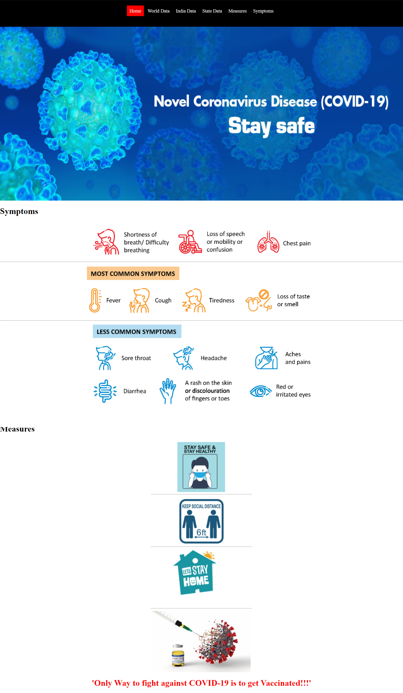
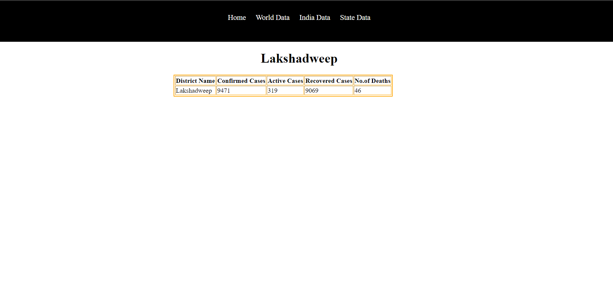

### Simple Corona virus status Website using covid api

### Website Link
Updated Link : https://covid-19-data-status.herokuapp.com/
Old Link : https://covid-19-status-display.herokuapp.com/

### Features:
### By using this website one can view the real time status of corona virus cases of

> * World data(Individual Countries)
> 
> * India data(Individual States)
> 
>  * State data(Individual Districts)
> 
> * We can see measures , symptoms of covid 19

# Used Laguages:
> * Html
> 
> *  php
> 
> * css

# Different  Api 's:
[world data](https://api.covid19api.com/summary)
> https://api.covid19api.com/summary

[State data](https://api.covid19india.org/data.json)
> https://api.covid19india.org/data.json
> 
[District data](https://api.covid19india.org/state_district_wise.json)
> https://api.covid19india.org/state_district_wise.json

# Sample Front End :

## Home Page

## World Data Page:

## State Data Page:

## District/Union Territory Data Page:

